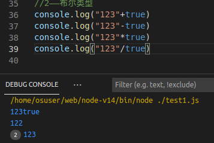
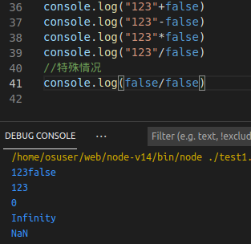

# javascript在node.js中的基本语法

### 1.变量申明和作用阈

变量申明：var,const,let(限制申明，也可以不添加)  const是常数，不可以修改


模块说明：{}中所包含的即为一个模块

let,const具有模块内作用域


var具有文件内作用域


不添加以上限制申明具有跨文件作用域（不推荐使用）


### 2.node.js对程序文件的封装

使用function (exports, require, module, __filename, __dirname) {我们的和程序文件}进行封装


### 3.函数

函数定义：

第一种


第二种


第三种


### 4.数据类型

```
值类型(基本类型)：字符串（String）、数字(Number)、布尔(Boolean)、对空（Null）、未定义（Undefined）、Symbol。

引用数据类型：对象(Object)、数组(Array)、函数(Function)。
```

1）字符串参与运算——数字类型和非数字类型字符串


若都为字符串，结果与上述相同


2）布尔值参与运算

true直接作为1参与运算



false直接作为0参与运算


特殊情况 false/false = NaN



### 5.运算符

算术运算符与大多数语言没有区别

比较运算符：


字符串比较：按单个元素进行比较，从位置0开始，以第一个不相等的为结论


### 6.模块

程序中模块的内容如果需要在其他模块中使用，必须用expors暴露。

