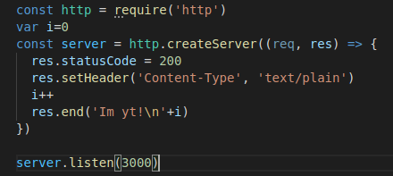
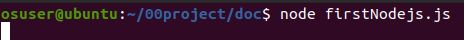
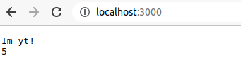
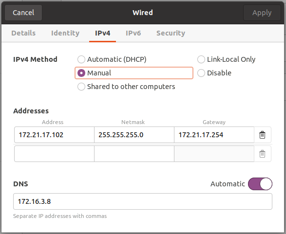
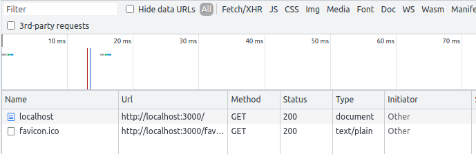
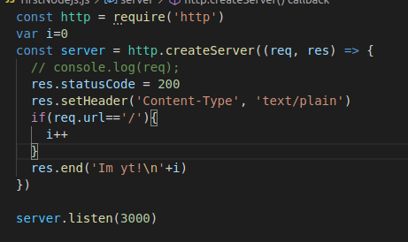
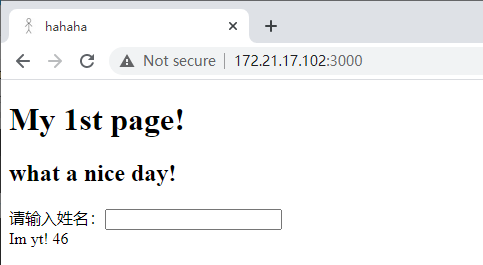

# 第三周

### 1.初始程序

javascript变量无类型，属于无类型语言，可以随时改变类型

statuscode是状态码，200为正常

setheader设置头属性

end是结束，没有end浏览器一直处于查询状态无法停止

### 

### 2.启动



保存程序后通过命令行的启动命令开启程序,ctrl+c可退出程序然后重新启动



程序存在每次点击都会自动加2的问题

### 3.修改网络配置



修改后可以在宿主机上访问网页

### 4.解决访问一次显示次数+2的问题

原因是因为浏览器每次访问有两个请求，一个是正常的/路径，还有一个是favicon.ico路径



所以只要在程序中判断路径在让ℹ+1即可



### 5.新建项目

1）创建新的文件夹

2）在新的文件夹中创建一个js文件

3）npm init --save进行初始化项目

### 6.nodejs的回调

异步编程的直接体现就是回调

回调函数在任务完成后就會被調用，例如讀取文件

##### 1)同步方式（又称阻塞代码）

```
const http = require('http')
var i = 0
const server = http.createServer((req, res) => {
    console.log(req);
    res.statusCode = 200
    res.setHeader('Content-Type', 'text/plain')
    if (req.url == '/') {
        i++
    }
    var fs = require("fs");
    var data = fs.readFileSync("input.txt")

    console.log(data.toString())

    res.end('Im yt!\n' + i + data.toString())
})

server.listen(3000)
```

##### 2)讀取html

```
const http = require('http')
var i = 0
const server = http.createServer((req, res) => {
    console.log(req);
    res.statusCode = 200
    res.setHeader('Content-Type', 'text/html')
    if (req.url == '/') {
        i++
    }
    var fs = require("fs");
    var data = fs.readFileSync("index.html")

    console.log(data.toString())

    res.end('Im yt!\n' + i + data.toString())
})

server.listen(3000)
```

##### 3）异步方式（不阻塞代码）

```
const http = require('http')
var i = 0
const server = http.createServer((req, res) => {
    console.log(req);
    res.statusCode = 200
    res.setHeader('Content-Type', 'text/html')
    if (req.url == '/') {
        i++
    }
    var fs = require("fs");
    fs.readFile('index.html', function (err, data) {
        if (err) return console.error(err);
        res.write(data)
        console.log(data.toString());
        res.end('Im yt!\n' + i )

    });
})
server.listen(3000)
```

##### 4)为网页加上图标

```
fs.readFile('1.jpg', function (err, data) {
            if (err) return console.error(err);
            res.write(data)
            res.end()
        });
```

##### 5）对于两次访问一次返回图标一次返回页面

```
const http = require('http')
var i = 0
const server = http.createServer((req, res) => {
    console.log(req);
    res.statusCode = 200
    res.setHeader('Content-Type', 'image/jpg')
    var fs = require("fs");

    if (req.url === '/favicon.ico') {
        fs.readFile('1.jpg', function (err, data) {
            if (err) return console.error(err);
            res.write(data)
            res.end()
        });
    }

    if (req.url == '/') {
        i++
        res.setHeader('Content-Type', 'text/html')
        fs.readFile('index.html', function (err, data) {
            if (err) return console.error(err);
            res.write(data)
            res.end('Im yt!\n' + i)
        });
    }

    // fs.createReadStream('1.jpg').pipe(res)

})
```



