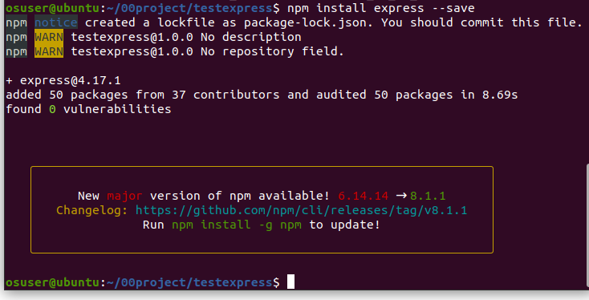
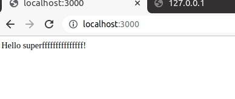
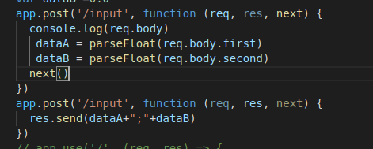

# 第八周--express

## 1.安装

建立正常的node.js项目

npm install express --save



## 2.路由写法

```javascript
app.METHOD(PATH, HANDLER)
//app is an instance of express.
//METHOD is an HTTP request method, in lowercase.
//PATH is a path on the server.
//HANDLER is the function executed when the route is matched.
```

用use的写法：

```javascript
app.use('/', (req, res) => {
    res.send('Hello use!')
  }
```

​	不区分使用什么方法访问，只要路径相同，都经过次路径

## 3.相同路由情况

对于相同路由，如果没有使用next（），则进入第一个路由

```javascript
const express = require('express')
const app = express()
const port = 3000

app.get('/', (req, res) => {
  res.send('Hello superfffffffffffffff!')
})

app.use('/', (req, res) => {
    res.send('Hello use!')
  })
  
// app.post('/', (req, res) => {
//     res.send('Hello post!')
//   })
  
app.listen(port, () => {
  console.log(`Example app listening at http://localhost:${port}`)
})
```



## 4.静态文件

基本写法：app.use(express.static('文件目录'))

此函数特征如下：

```
express.static(root, [options])
```

例如，通过如下代码就可以将 public 目录下的图片、CSS 文件、JavaScript 文件对外开放访问了：

```
app.use(express.static('public'))
```

可以访问 public 目录中的所有文件了：

```
http://localhost:3000/images/kitten.jpg
http://localhost:3000/css/style.css
http://localhost:3000/js/app.js
http://localhost:3000/images/bg.png
http://localhost:3000/hello.html
```

#### 虚拟路径

```
app.use('/',express.static('public'))
app.use('/',express.static('private'))
```

将public，private都映射到了前端的根路径下

#### 物理路径的绝对路径写法

```
app.use('/static', express.static(path.join(__dirname, 'public')))
```

## 发送：sendfile

要求文件绝对路进写法，回调参数是err

### 中间件

路由中调用next，允许再次进入其他路由

