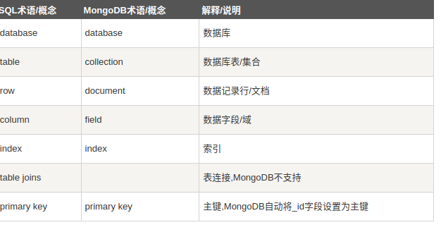

# mongodb配置与使用

## 1.mongodb配置

1）下载解压缩

osuser@ubuntu:~/web$ tar -zxvf mongodb-linux-x86_64-ubuntu2004-5.0.2.tgz 

2）测试

建立数据存储目录，注意权限，建议建在家目录下。

mongdb软件目录结构：


打开服务器端应用：mongod --dbpath数据目录


打开客户端程序：mongoshell


测试完成先关闭客户端，在关闭服务端，配置路径

编辑home下的.bashrc文件，把mongodb应用路径写入。


保存退出后执行：. .bashrc

在任意路径测试执行：

测试正常

## 2.mongodb基本概念



没有严格的统一字段概念

## 3.mongodb shell的使用

1）数据库显示：show dbs


2）切换数据库：use 数据库名

没有新建数据库命令，如果数据库名不存在，就新建数据库，前提是向此数据库里写入了内容

```
> use testuser
switched to db testuser
> db.student.insert({serial:001;name:'lkk'})
uncaught exception: SyntaxError: missing } after property list :
@(shell):1:29
> db.student.insert({serial:001,name:'lkk'})
WriteResult({ "nInserted" : 1 })
> show collection
uncaught exception: Error: don't know how to show [collection] :
shellHelper.show@src/mongo/shell/utils.js:1211:11
shellHelper@src/mongo/shell/utils.js:838:15
@(shellhelp2):1:1
> show collections
student
> db.student.find({})
{ "_id" : ObjectId("61887f1d98d0149d9dee4d5c"), "serial" : 1, "name" : "lkk" }
> 
```

3)显示数据集（表）

show collections(tables)


4)创建数据集

直接向数据集中写入文档，就创建了数据集。


5）向数据集写入文档

写入方法：db.数据集.写入方法（insert,或insertmany）（{文档}）

6）查找文档

基本格式：

db.数据集.find(查找字串)

# 4.vscode   mongodb插件

安装

安装完成户左侧会出现mongo图标，点击该图标：


点击“connect”后在最上端出现输入框


输入连接字符串，例如：mongodb://localhost:27017


连接成功，在左侧页面以属性结构显示mongodb的内容。

可以通过playground对数据库进行操作：


当前没有运行图标，需要改文件扩展名


创建集合：


创建定长集合（保留最后的数据）

```javascript
use('testuser');
options={ capped : true,  size : 
   6142800, max : 2 } 
// The drop() command destroys all data from a collection.
// Make sure you run it against the correct database and collection.
// db.sales.drop();
db.createCollection("student2", options)

// Insert a few documents into the sales collection.
db.student2.insertMany([
  { 'serial': 1, 'item': 'yyy', 'price': 10, 'quantity': 2, 'date': new Date('2014-03-01T08:00:00Z') },
  { 'serial': 2, 'item': 'kkk', 'price': 20, 'quantity': 1, 'date': new Date('2014-03-01T09:00:00Z') },
  { 'serial': 3, 'item': 'hello', 'price': 5, 'quantity': 10, 'date': new Date('2014-03-15T09:00:00Z') },
  { 'serial': 4, 'item': 'asdasdasd', 'price': 5, 'quantity':  20, 'date': new Date('2014-04-04T11:21:39.736Z') },
]);
```

插入文档：


删除文档：


注意：如果条件为空，则删除所有文档

查找文档：


# 5）用程序进行操作

创建一个mongotest项目


导入依赖：


连接数据库插入数据

```javascript
const mongodb=require("mongodb")
const MongoClient = mongodb.MongoClient
const url = "mongodb://localhost:27017/";
MongoClient.connect(url, function(err, db) {
    if (err) throw err;
    var dbo = db.db("runoob");
    var myobj = { name: "菜鸟教程", url: "www.runoob" };
    dbo.collection("site").insertOne(myobj, function(err, res) {
        if (err) throw err;
        console.log("文档插入成功");
        db.close();
    });
});
```

插入成功：


