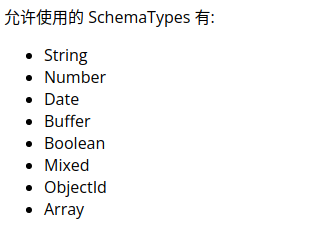

# mongoose的使用

## 1）安装

创建nodejs项目

npm install mongoose --save

要求已经安装并打开了mongdb数据库

2)使用流程

```javascript
//引入mongoose
const mongoose = require('mongoose');
//连接数据库
mongoose.connect('mongodb://localhost/test');
//创建一个schema
const schema={
    name:String,
    age:Number,
    health:String
}
//创建一个model
//创建的schema只有在创建model时饮用才可以起作用
const Cat = mongoose.model('Cat', schema);

//写入数据库
const kitty = new Cat({ name: 'Zildjian' });
kitty.save().then(() => console.log('meow'));
```

mongoose有自己定义的 基本数据类型



```javascript
  var blogSchema = new Schema({
    title:  String,
    author: String,
    body:   String,
    comments: [{ body: String, date: Date }],
    date: { type: Date, default: Date.now },
    hidden: Boolean,
    meta: {
      votes: Number,
      favs:  Number
    }
  });
```

创建的schema生效后，存储到数据库必须遵守，否则是一个空数据

### 数据查找

model.find({查询条件}，callback(err,查询结果)=>{})

```javascript
Cat.find({name:"kk"},(err,data)=>{console.log(data[0]._doc)})
```

